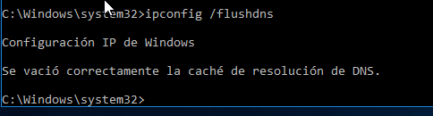
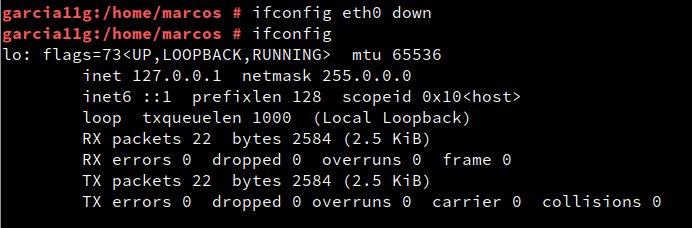
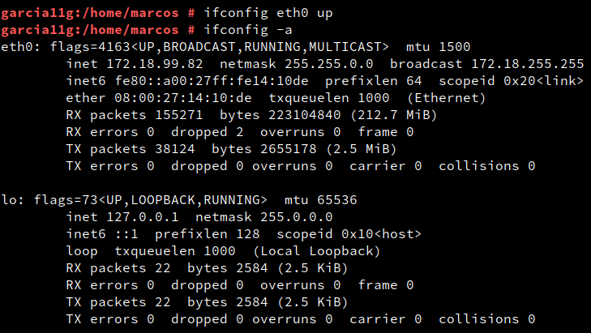
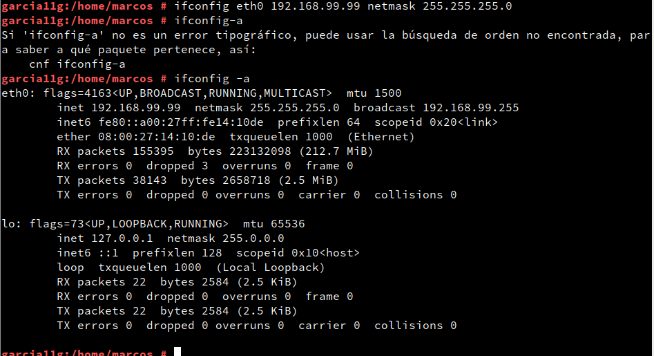
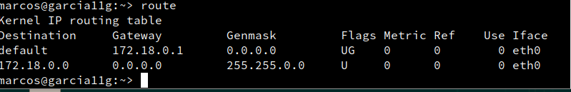
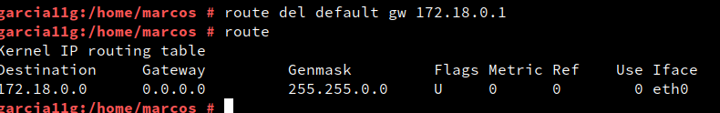
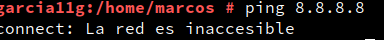
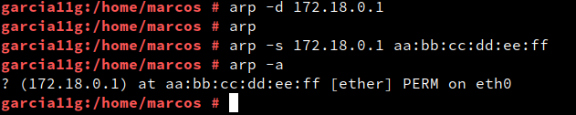
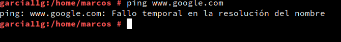
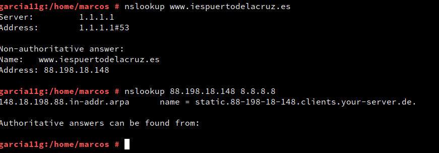

# Comandos de red (Windows y Linux)

***Nombre:***
***Curso:*** 1º de Ciclo Superior de Administración de Sistemas Informáticos en Red.

### ÍNDICE

+ [Introducción](#id1)
+ [Objetivos](#id2)
+ [Material empleado](#id3)
+ [Desarrollo](#id4)
+ [Conclusiones](#id5)

#### ***Introducción***. 

En esta práctica vamos a ver los comandos de red en maquinas tanto Linux Como Windows.

#### ***Objetivos***. 

Ver la utilidad de estos comandos para el analisis de redes.

#### ***Material empleado***. 

Maquina virtual Linux(OpenSuse)
Maquina virtual Windows 10

#### ***Desarrollo***. 

1- Use el comando ipconfig /all para ver la dirección MAC de tu equipo. Y la siguiente aplicación
http://coffer.com/mac_find/ para rellenar la siguiente tabla.

<table>
<thead>
  <tr>
    <th>Dirección IPv4</th>
    <th>172.18.99.202</th>
  </tr>
</thead>
<tbody>
  <tr>
    <td>Máscara</td>
    <td>255.255.0.0</td>
  </tr>
  <tr>
    <td>Gateway</td>
    <td>172.18.0.1</td>
  </tr>
  <tr>
    <td>MAC</td>
    <td>08-00-27-87-C1-50</td>
  </tr>
  <tr>
    <td>Fabricante</td>
    <td>Intel</td>
  </tr>
  <tr>
    <td>Dirección IPv6</td>
    <td>fe80::3857:dfe:acda:f578%5</td>
  </tr>
  <tr>
    <td>Servidores DNS</td>
    <td>80.58.61.250 y 172.18.0.1</td>
  </tr>
  <tr>
    <td>Tiempo de concesión de la IP</td>
    <td>3 segundos</td>
  </tr>
  <tr>
    <td>Nombre del adaptador de red</td>
    <td>Intel(r) Pro/1000MT desktop Adapter</td>
  </tr>
</tbody>
</table>

2- Liberar la configuración IP del adaptador con ipconfig /release y a continuación volver a usar el
comando ipconfig.
¿Cuál es la ip ahora?

169.254.116.177

3- Ejecutar el comando ipconfig /renew solicitando una renovación de dirección IP. A continuación
volver a ejecutar ipconfig. ¿Cuál es la nueva ip?

17.18.99.202

4- Ejecutar el comando ipconfig /displaydns y comprobar la información que contiene la caché DNS
de tu equipo. Ejecuta ahora el comando ipconfig /flushdns y después muestra otra vez el
contenido de la caché DNS. ¿Qué información muestra ahora? ¿Qué ha ocurrido?

/displaydns

5- Usar el navegador para ir a la web http://www.iespuertodelacruz.es y luego ejecutar el comando
ipconfig /displaydns. Hacer una captura de pantalla donde se muestre que se ha cacheado la ip de
ese nombre de dominio y pegarla aquí debajo.

6-Borra la caché DNS con el comando ipconfig /flushdns y muestra una captura de pantalla en que
se vea que ya no hay registros DNS en caché.

Linux

Ejecuta el comando ifconfig y rellena lo que puedas de la siguiente tabla.

<table>
<thead>
  <tr>
    <th>Dirección IPv4</th>
    <th>172.18.99.202</th>
  </tr>
</thead>
<tbody>
  <tr>
    <td>Máscara</td>
    <td>255.255.0.0</td>
  </tr>
  <tr>
    <td>Gateway</td>
    <td>172.18.0.1</td>
  </tr>
  <tr>
    <td>MAC</td>
    <td>08-00-27-87-C1-50</td>
  </tr>
  <tr>
    <td>Fabricante</td>
    <td>Intel</td>
  </tr>
  <tr>
    <td>Dirección IPv6</td>
    <td>fe80::3857:dfe:acda:f578%5</td>
  </tr>
  <tr>
    <td>Servidores DNS</td>
    <td>80.58.61.250 y 172.18.0.1</td>
  </tr>
  <tr>
    <td>Tiempo de concesión de la IP</td>
    <td>3 segundos</td>
  </tr>
  <tr>
    <td>Nombre del adaptador de red</td>
    <td>Intel(r) Pro/1000MT desktop Adapter</td>
  </tr>
</tbody>
</table>

2- Desactiva tu tarjeta de red con el comando ifconfig eth0 down. A continuación, comprueba con un
ifconfig que la tarjeta ya no aparece, se ha desactivado. Haz una captura de pantalla donde se vea
que ya no está activada.

/ifcongif eth0 down

/ifconfig eth0 up

3- Usa el comando ifconfig eth0 192.168.99.99 netmask 255.255.255.0 y pega una captura de
pantalla que muestre que el adaptador de red se ha configurado correctamente.

4- Usa el comando ifconfig eth0 IP netmask Máscara (con la configuración inicial de red) y pega una
captura de pantalla que muestre que el adaptador de red se ha configurado correctamente.

3- Comando ping (windows y Linux)

Desde una máquina con línux ejecuta el comando ping –s 100 –c 2 ip_puertadeenlace para que se envíen dos ecos de 100 bytes. Muestra una captura de pantalla con el resultado.

Desde una máquina con windows usa el comando ping –i 2 ip_puertadeenlace para hacer un ping a nuestra puerta de enlace con un TTL igual a 2. Luego haz un ping de las mismas características, pero a google ping –i 2 www.google.es. Pega una captura de pantalla con el resultado y explica lo que ha pasado.

El comando ping nos da información sobre el tiempo de latencia de una red. Haz un ping a nuestra puerta de enlace y luego a otro a www.google.es. Busca información de lo que es el tiempo de latencia y compara los tiempos de latencia en ambos casos

Ping google

Ping puerta de enlace

La latencia es tan diferente ya que para hacer un ping a google primero se pasa por internet, mientras que para hacer un ping a la puerta de enlace se hace en local por lo que la latencia es mucho menor.

4. Comando route

1- Usa el comando route para ver la puerta de enlace de tu equipo. ¿Cuál es tu puerta de enlace?

2- Borra la puerta de enlace usando el comando Route del default gw ip_gateway. A continuación, ejecuta el comando route para comprobar que ya no hay puerta de enlace. Intenta navegar por internet y verás que tampoco puedes. Haz una captura de pantalla con la salida del comando route y del resultado de ping 8.8.8.8 ¿Cómo interpretas el mensaje que te devuelve el ping?

Borrar y comprobar el gateway

Ping a 8.8.8.8

3- Vuelve a configurar la puerta de enlace usando el comando route add default gw ip_gateway y comprueba que ya ha vuelto la puerta de enlace con el comando route. 

5. Comando netstat

Abre una página web cualquiera y luego ejecuta el comando netstat -t para que nos muestre las conexiones que tenemos abiertas por tcp. Pon una captura de pantalla del resultado y explica lo que es cada una de las columnas que aparecen.

Ahora espera unos segundos y vuelve a ejecutar netstat -tn. Comprobarás que algunas de las conexiones se han cerrado o están esperando para cerrarse. Además con la opción -n verás los resultados en formato numérico. Pon una captura de pantalla y explica la diferencia entre Established, Time_wait y Close_Wait.

Established: ya se ha realizado la conexion

Time_wait: esta en el proceso de conectarse

Ejecuta ahora la orden netstat -at para que muestre las tanto las conexiones tcp abiertas como los puertos que están a la escucha. Copia una captura de pantalla donde se vean los puertos que tienes escuchando, explica qué significan los asteriscos en la columna “Foreign address” e
investiga si tener esos puertos abiertos es normal o supone una amenaza.

El asterisco siginifica que no esta establecido, si el puerto esta abierto en un router del hogar puede ser peligroso, pero si se trata de un puerto publico no deberia ser un problema

Ejecuta el comando netstat -s para ver las estadísticas de red y haz una captura en la que se vean cuantos paquetes tcp has recibido y cuantos de ellos han sido erroneos.

6. Comando arp

Borra toda la caché ARP con el comando arp -d *. A continuación haz un ping a la puerta de enlace. Pon una captura de la tabla ARP en que se vea que solo está la puerta de enlace y su mac.

Ahora borra manualmente la entrada arp de la puerta de enlace con la orden arp -d ip_puertadeenlace. Luego introduce manualmente una mac falsa para la puerta de enlace en la tabla arp con el comando arp -s ip_puertadeenlace aa:bb:cc:dd:ee:ff Haz una captura de pantalla en que se vea el resultado del comando arp -a y de hacer un ping a google. Explica por qué ahora
no hay internet.

Por que la direccion mac falsa no puede encontrar la web que le estamos poniendo

Borra la entrada falsa de la tabla arp con el comando arp -d ip_puertadeenlace.

7.	Comando	nslookup	(Windows	y	Linux)

Averigua el nombre del servidor DNS de www.iespuertodelacruz.es. A continuación, ejecutamos el comando nslookup nombreServidorDNS y luego el comando nslookup nombreServidorDNS 8.8.8.8. Explica las causas de las diferencias que hay entre los resultados de las dos consulta

El servidor DNS del una pagina web se puede ver sin necesidad de autorización mientras que en el de google se necesita autorizacion.

#### ***Conclusiones***. 

En esta practica se ha visto como usar los comandos de red necesarios para ver la ip4 la configuración de red con el comando ipconfig y ifconfig(Linux), hacer un ping tanto a un pc como a una web, ver el servidor DNS de una web cualquiera, el comando route para ver la puerta de enlace y la conectividad, netstat para ver las conexiones de nuestra red, el comando arp para dar y quitar una direccion mac falsa y asi comprobar la red y por último el comando nslookup para saber si se puede ver el servidor dns de una web comparado a la de un puerto publico.
